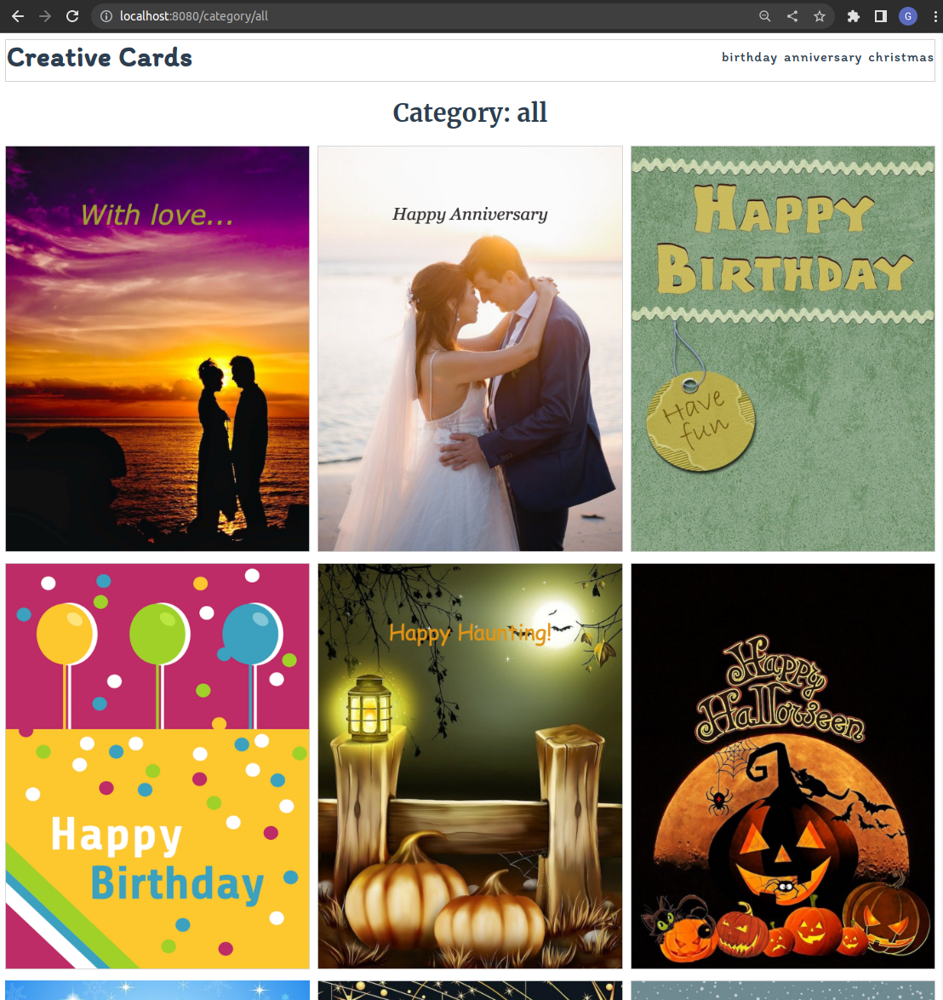

# creative-cards-vue
Vue 3 creative cards application

<table>
  <tr>
    <td valign="top"></td>
    <td valign="top"></td>
</tr>
</table>


## Project setup
```
yarn install
```

### Compiles and hot-reloads for development
```
yarn serve
```

### Compiles and minifies for production
```
yarn build
```

### Lints and fixes files
```
yarn lint
```

### Customize configuration
See [Configuration Reference](https://cli.vuejs.org/config/).


